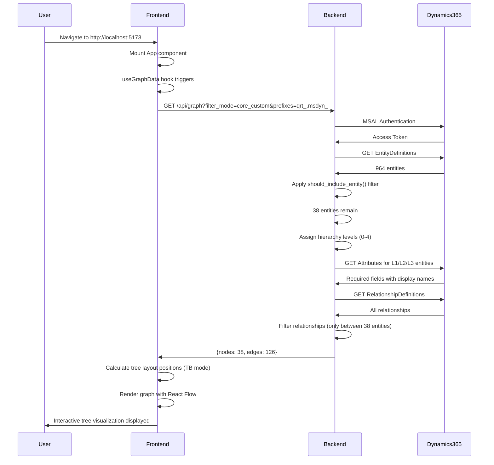
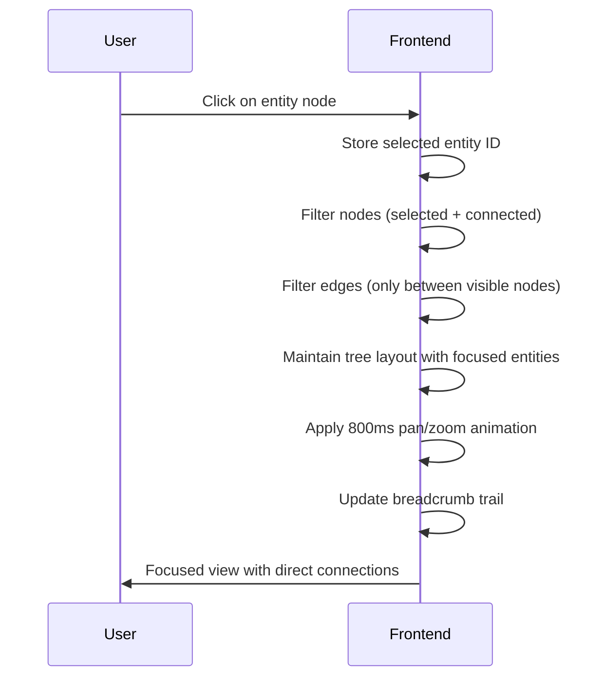
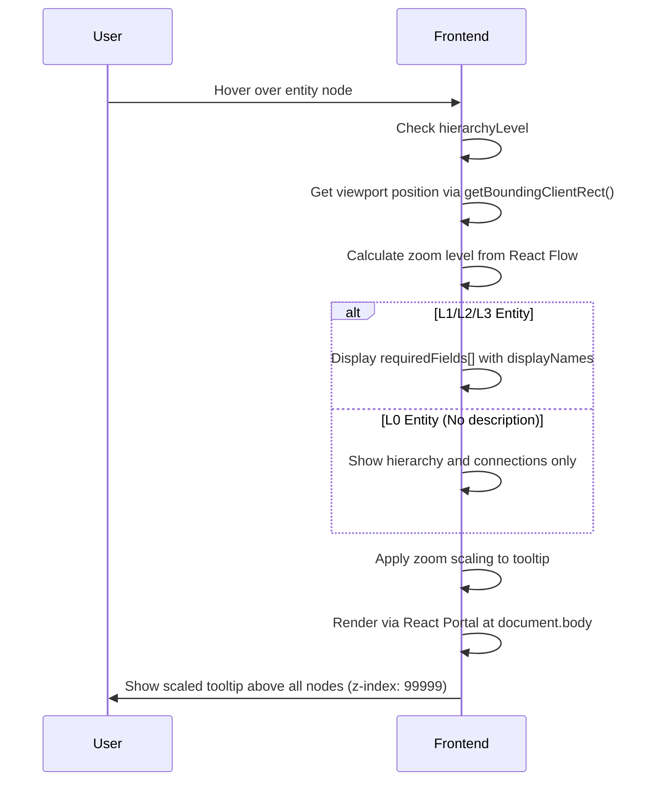

# System Architecture

## Table of Contents
1. [Overview](#overview)
2. [High-Level Architecture](#high-level-architecture)
3. [Data Flow](#data-flow)
4. [Backend Architecture](#backend-architecture)
5. [Frontend Architecture](#frontend-architecture)
6. [Authentication & Security](#authentication--security)
7. [Entity Filtering Strategy](#entity-filtering-strategy)
8. [Required Fields Implementation](#required-fields-implementation)
9. [Layout Algorithms](#layout-algorithms)
10. [UI/UX Design System](#uiux-design-system)
11. [Performance Optimizations](#performance-optimizations)
12. [Production Considerations](#production-considerations)

---

## Overview

The AOS Blueprint (formerly Dynamics 365 Entity Relationship Visualizer) is a full-stack web application that provides an interactive visualization of Dynamics 365 entity relationships. The system intelligently filters 964 entities down to 38 relevant entities and displays them in a hierarchical tree layout with an intuitive, modern UI.

### Key Metrics
- **Total Dynamics Entities:** 964
- **Filtered Entities Displayed:** 38 (96% reduction)
- **Relationships Visualized:** ~126
- **Initial Load Time:** ~2 seconds
- **Interaction Latency:** <100ms

### Application Name
**AOS Blueprint** - Reflects the structured, architectural nature of entity relationships

---

## High-Level Architecture

```
┌─────────────────────────────────────────────────────────────────┐
│                         User Browser                             │
│  ┌────────────────────────────────────────────────────────────┐ │
│  │   React Frontend (TypeScript + React Flow)                 │ │
│  │   - Interactive Tree Visualization (TB/LR)                 │ │
│  │   - Sliding Panels (Search/Filters)                        │ │
│  │   - Search, Breadcrumbs, Hierarchy Filters                 │ │
│  │   - Aspen Power Brand Colors                               │ │
│  │   - Light/Dark Mode Support                                │ │
│  └────────────────────────────────────────────────────────────┘ │
│                            ↕ HTTP/REST                           │
└───────────────────────────────────────────────────────────────────┘
                              │
                              ↓
┌─────────────────────────────────────────────────────────────────┐
│                    FastAPI Backend (Python)                      │
│  ┌────────────────────────────────────────────────────────────┐ │
│  │   API Endpoints                                            │ │
│  │   - /api/graph      (filtered entities + relationships)   │ │
│  │   - /api/entities   (all filtered entities)               │ │
│  │   - /health         (health check)                        │ │
│  └────────────────────────────────────────────────────────────┘ │
│  ┌────────────────────────────────────────────────────────────┐ │
│  │   Business Logic                                           │ │
│  │   - Entity Filtering (should_include_entity)              │ │
│  │   - Hierarchy Assignment (get_hierarchy_level) 0-4        │ │
│  │   - Required Fields Fetching (for L1/L2/L3)               │ │
│  └────────────────────────────────────────────────────────────┘ │
│                            ↕ MSAL + HTTPS                        │
└─────────────────────────────────────────────────────────────────┘
                              │
                              ↓
┌─────────────────────────────────────────────────────────────────┐
│                  Microsoft Dynamics 365 CRM                      │
│                   (aos.crm.dynamics.com)                         │
│  ┌────────────────────────────────────────────────────────────┐ │
│  │   Web API v9.2                                             │ │
│  │   - EntityDefinitions (metadata)                           │ │
│  │   - RelationshipDefinitions                                │ │
│  │   - Attributes (for required fields)                       │ │
│  └────────────────────────────────────────────────────────────┘ │
└─────────────────────────────────────────────────────────────────┘
```

---

## Data Flow

### 1. Initial Page Load



### 2. Entity Click Interaction



### 3. Hover Tooltip Interaction



---

## Backend Architecture

### Technology Stack
- **Framework:** FastAPI 0.104+
- **Language:** Python 3.10+
- **Authentication:** MSAL (Microsoft Authentication Library)
- **HTTP Client:** requests (with session pooling)
- **API Standard:** RESTful with OpenAPI/Swagger docs

### Directory Structure

```
backend/
├── app.py                           # FastAPI application entry point
│   ├── CORS middleware configuration
│   ├── Router registration
│   └── Health check endpoint
│
├── routes/
│   └── entities.py                  # API endpoint handlers
│       ├── GET /api/entities        # All filtered entities
│       ├── GET /api/relationships   # All relationships
│       └── GET /api/graph           # Combined graph data
│
├── services/
│   ├── dynamics_service.py          # Core business logic
│   │   ├── should_include_entity()  # Filtering logic (38 from 964)
│   │   ├── get_hierarchy_level()    # Assigns 0-4 hierarchy levels
│   │   └── get_all_entities()       # Fetches & processes entities
│   │
│   └── entity_filters.py            # Advanced filtering utilities
│       ├── SYSTEM_ENTITIES          # Exclusion list (300+ entities)
│       ├── CORE_BUSINESS_ENTITIES   # Always-include list
│       └── filter_core_and_custom() # Combines core + custom
│
└── requirements.txt                 # Python dependencies
```

### Key Components

#### 1. Entity Filtering (`should_include_entity`)

**Location:** `backend/services/dynamics_service.py:25-72`

**Purpose:** Reduces 964 entities to 38 by applying business rules.

**Logic:**
```python
def should_include_entity(logical_name: str, is_custom: bool) -> bool:
    # Step 1: Check exclusion list (11 hardcoded entities)
    if logical_name in excluded_entities:
        return False

    # Step 2: Include required system/Microsoft entities
    if logical_name in ['account', 'contact', 'systemuser', 'msdyn_project']:
        return True

    # Step 3: Include all qrt_ custom entities (team entities)
    if logical_name.startswith('qrt_'):
        return True

    # Step 4: Exclude everything else
    return False
```

**Excluded Entities (11):**
- `qrt_taskconfiguration`, `qrt_taskrules`, `qrt_taskconfigrule`
- `qrt_bidissuance`, `qrt_submittals`, `qrt_assetcontract`
- `qrt_bidpackage` (+ 2 junction tables)
- `qrt_departmentheadsmeetingagenda`, `qrt_flowconfiguration`
- `task` (system entity)

**Result:** 38 entities (34 qrt_ + 3 system + 1 Microsoft)

#### 2. Hierarchy Assignment (`get_hierarchy_level`)

**Location:** `backend/services/dynamics_service.py:75-125`

**Purpose:** Assigns visual hierarchy levels for tree layout positioning and color coding.

**Updated Hierarchy (0-4 System):**
| Level | Color | Entities | Count | Badge |
|-------|-------|----------|-------|-------|
| **0** | Gray/Slate | `contact`, `systemuser` | 2 | System |
| **1** | Rose/Coral | `account` | 1 | System |
| **2** | Cyan/Ocean Blue | `qrt_portfolio`, `msdyn_project` | 2 | Custom/System |
| **3** | Emerald/Green | 15 child entities (bonds, permits, etc.) | 15 | Custom |
| **4** | Purple/Violet | All other qrt_ entities | 18 | Custom |

**Special Badge Logic:**
- **System Badge (Blue):** contact, systemuser, account, msdyn_project (Plan)
- **Custom Badge (Purple):** All qrt_* entities not marked as System
- **Priority:** System badge takes precedence over Custom if both apply

**Note on msdyn_project:**
Despite being from Microsoft's Project Service Automation solution, `msdyn_project` returns `IsCustomEntity: True` in the Dynamics API, likely because it was installed as a managed solution. We explicitly mark it with a "System" badge for business clarity.

#### 3. Required Fields Fetching

**Location:** `dynamics_api/dynamics_api.py:420-463`

**Purpose:** Fetch actual required fields from Dynamics for L1/L2/L3 entities.

**API Call:**
```
GET /api/data/v9.2/EntityDefinitions(LogicalName='account')/Attributes
    ?$select=LogicalName,RequiredLevel,DisplayName
```

**Filtering:**
- Only attributes where `RequiredLevel.Value` is `ApplicationRequired` or `SystemRequired`
- Returns both `displayName` (user-friendly) and `logicalName` (technical)

**Why Only L1/L2/L3?**
- Performance: Reduces API calls from 38 to 18 entities
- Relevance: L0/L4 entities don't display required fields in tooltips
- Load time: 2s vs 4-5s if all entities fetched

---

## Frontend Architecture

### Technology Stack
- **Framework:** React 18
- **Language:** TypeScript 5.2+
- **Graph Library:** React Flow v12
- **Styling:** Tailwind CSS with dark mode support
- **Build Tool:** Vite
- **State Management:** React hooks (useState, useEffect, useMemo, useCallback)
- **Portals:** React createPortal for tooltips

### Directory Structure

```
frontend/src/
├── components/
│   ├── EntityGraph.tsx              # Main graph component
│   │   ├── Graph state management
│   │   ├── Tree layout (TB/LR modes)
│   │   ├── Sliding panels (search + filters)
│   │   ├── Search functionality with autocomplete
│   │   ├── Hierarchy filters (0-4)
│   │   ├── Breadcrumb navigation
│   │   └── Edge hover highlighting
│   │
│   ├── EntityNode.tsx               # Custom node component
│   │   ├── Hierarchy-based colors
│   │   ├── System/Custom/Activity badges
│   │   ├── Hover tooltip with React Portal
│   │   ├── Viewport-based positioning
│   │   ├── Zoom-scaled tooltips
│   │   ├── Required fields display
│   │   └── Dark mode support
│   │
│   └── SearchBar.tsx                # Autocomplete search component
│
├── utils/
│   └── layoutHelpers.ts             # Layout algorithms
│       └── getHierarchyLayout()     # Manual tree layout (TB/LR)
│           ├── Multi-row wrapping (max 6 per row)
│           ├── Centered alignment
│           └── Dynamic spacing
│
├── hooks/
│   └── useGraphData.ts              # API data fetching hook
│
├── api/
│   └── dynamicsApi.ts               # Axios API client
│
├── contexts/
│   └── ThemeContext.tsx             # Light/Dark mode provider
│
└── types/
    └── index.ts                     # TypeScript interfaces
        ├── Entity
        ├── RequiredField
        ├── Relationship
        └── GraphData
```

### Key Components

#### 1. Entity Graph (`EntityGraph.tsx`)

**Responsibilities:**
- Fetch graph data via `useGraphData()` hook
- Manage layout state (Tree TB vs Tree LR)
- Handle user interactions (click, search, filter, hover)
- Apply hierarchy visibility filters (0-4)
- Track breadcrumb navigation
- Manage sliding panels (search + filters)
- Theme-aware edge colors

**State Management:**
```typescript
const [selectedEntity, setSelectedEntity] = useState<string | null>(null);
const [visibleLevels, setVisibleLevels] = useState(new Set([0, 1, 2, 3, 4]));
const [hoveredEntityId, setHoveredEntityId] = useState<string | null>(null);
const [breadcrumbs, setBreadcrumbs] = useState<string[]>([]);
const [layoutMode, setLayoutMode] = useState<'tree-tb' | 'tree-lr'>('tree-tb');
const [showSearchPanel, setShowSearchPanel] = useState<boolean>(true);
const [showInstructionsPanel, setShowInstructionsPanel] = useState<boolean>(true);
```

**Layout Modes:**
| Mode | Icon | Description | Default Spacing |
|------|------|-------------|-----------------|
| Tree TB | ↓ | Top to Bottom hierarchical | Level: 200px, Box: 150px, Row: 100px |
| Tree LR | → | Left to Right hierarchical | Level: 400px, Box: 150px, Col: 100px |

**Sliding Panels:**
- **Left Panel (Search):** 400px wide, slides left to hide
- **Right Panel (Filters):** 280px wide, slides right to hide
- Toggle buttons: « (show) / » (hide)
- Smooth 300ms transition

#### 2. Entity Node (`EntityNode.tsx`)

**Responsibilities:**
- Render custom node UI with hierarchy colors
- Display System/Custom/Activity badges
- Show hover tooltips with React Portal
- Handle viewport-based tooltip positioning
- Apply zoom scaling to tooltips
- Support light/dark mode

**Fixed Width:**
- All entity boxes: **220px** (prevents overlapping with long names)

**Color Scheme (Updated):**
```typescript
const colors = {
  L0: "border-slate-400 bg-gradient-to-br from-slate-50 to-gray-50",     // System (Gray)
  L1: "border-rose-400 bg-gradient-to-br from-rose-50 to-pink-50",       // Account (Coral)
  L2: "border-cyan-400 bg-gradient-to-br from-cyan-50 to-blue-50",       // Portfolio/Project (Ocean)
  L3: "border-emerald-400 bg-gradient-to-br from-emerald-50 to-teal-50", // Child Entities (Green)
  L4: "border-purple-400 bg-gradient-to-br from-purple-50 to-violet-50", // Other qrt_ (Purple)
};
```

**Badge System:**
```typescript
// System Badge (Blue) - Priority
const systemEntities = ['contact', 'systemuser', 'account', 'msdyn_project'];
if (isSystemEntity) {
  return <Badge color="blue">System</Badge>;
}

// Custom Badge (Purple)
if (isCustomEntity && !isSystemEntity) {
  return <Badge color="purple">Custom</Badge>;
}

// Activity Badge (Green)
if (isActivity) {
  return <Badge color="emerald">Activity</Badge>;
}
```

**Tooltip Implementation:**
```typescript
// Use React Portal to render at document.body (breaks stacking context)
const tooltipContent = showTooltip && (
  <div
    className="fixed ..."
    style={{
      left: `${tooltipPosition.x}px`,
      top: `${tooltipPosition.y}px`,
      transform: `translateY(-50%) scale(${getZoom()})`,  // Zoom scaling
      transformOrigin: 'left center',
      zIndex: 99999,  // Always on top
    }}
  >
    {/* Tooltip content with requiredFields or hierarchy info */}
  </div>
);

return (
  <>
    <div ref={nodeRef} onMouseEnter={...} onMouseLeave={...}>
      {/* Node content */}
    </div>
    {tooltipContent && createPortal(tooltipContent, document.body)}
  </>
);
```

**Tooltip Positioning:**
1. Get node position via `getBoundingClientRect()`
2. Calculate viewport coordinates (fixed positioning)
3. Get zoom level from `useReactFlow().getZoom()`
4. Apply `scale(zoom)` transform to maintain proportional size

---

## Authentication & Security

### MSAL Authentication Flow

**Token Acquisition:**
```python
# dynamics_api/dynamics_api.py
def _get_access_token(self) -> str:
    scopes = [DYNAMICS_SCOPES]  # "https://aos.crm.dynamics.com/.default"
    token = self.msal_app.acquire_token_for_client(scopes)
    return token['access_token']
```

**Session Management:**
```python
def create_http_session(self) -> requests.Session:
    access_token = self._get_access_token()
    session = requests.Session()
    session.headers.update({'Authorization': f'Bearer {access_token}'})
    return session
```

**Token Refresh:**
- MSAL automatically handles token caching
- Tokens refreshed on expiry (typically 1 hour)
- No manual refresh logic needed

### Security Best Practices

**Environment Variables (.env):**
```bash
DYNAMICS_AUTHORITY=https://login.microsoftonline.com/{TENANT_ID}
DYNAMICS_CLIENT_ID={APP_CLIENT_ID}
DYNAMICS_CLIENT_SECRET={CLIENT_SECRET}  # Rotate every 90 days
DYNAMICS_RESOURCE_URL=https://aos.crm.dynamics.com/
DYNAMICS_SCOPES=https://aos.crm.dynamics.com/.default
```

**CORS Configuration:**
```python
# backend/app.py
app.add_middleware(
    CORSMiddleware,
    allow_origins=["http://localhost:5173", "http://localhost:5174"],
    allow_credentials=True,
    allow_methods=["*"],
    allow_headers=["*"],
)
```

**Production Recommendations:**
- Use Azure Key Vault for secrets
- Enable Azure AD Conditional Access
- Implement rate limiting (SlowAPI)
- Add request logging and monitoring
- Use environment-based CORS (not hardcoded)

---

## Entity Filtering Strategy

### Why Filtering is Necessary

**Problem:** Dynamics 365 contains 964 entities, but only ~4% are relevant for business visualization.

**Categories of Entities:**
| Category | Count | Examples | Include? |
|----------|-------|----------|----------|
| System/Metadata | ~350 | systemform, workflow, solution | ❌ No |
| Microsoft Standard | ~300 | email, task, phonecall | ❌ No (except account, contact) |
| Team Custom (qrt_) | 45 | qrt_portfolio, qrt_bonds | ✅ Yes (except 11 excluded) |
| Microsoft Custom (msdyn_) | ~200 | msdyn_project | ✅ Only msdyn_project |
| Other Custom | ~70 | Various | ❌ No |

**Result:** 964 → 38 entities (96% reduction)

### Filtering Implementation

**Two-Stage Filtering:**

**Stage 1: Entity-Level (`should_include_entity`)**
- Applied in `dynamics_service.py`
- Filters entities before fetching relationships
- **Input:** 964 entities
- **Output:** 38 entities

**Stage 2: Relationship Filtering (`filter_core_and_custom`)**
- Applied in `entity_filters.py`
- Filters relationships to only those between included entities
- **Input:** 12,490 relationships
- **Output:** 126 relationships

---

## Required Fields Implementation

### Why Required Fields?

**Business Need:** Users need to know which fields are mandatory when creating records.

**Challenge:** Dynamics EntityDefinitions don't include a `createdBy` field, so we can't filter by creator programmatically.

**Solution:**
1. Fetch actual required fields from Dynamics API
2. Only fetch for L1/L2/L3 entities (performance optimization)
3. Display user-friendly display names (not technical logical names)

### API Implementation

**Endpoint Used:**
```
GET /api/data/v9.2/EntityDefinitions(LogicalName='{entity}')/Attributes
    ?$select=LogicalName,RequiredLevel,DisplayName
```

**Response Parsing:**
```python
for attr in response_data.get('value', []):
    required_level = attr.get('RequiredLevel', {})
    if required_level.get('Value') in ['ApplicationRequired', 'SystemRequired']:
        display_name = extract_display_name(attr.get('DisplayName'))
        required_attributes.append({
            'displayName': display_name,  # "Account Name"
            'logicalName': attr.get('LogicalName')  # "name"
        })
```

**Performance Metrics:**
| Approach | Entities | API Calls | Load Time |
|----------|----------|-----------|-----------|
| All entities | 38 | 38 | ~5 seconds |
| L1/L2/L3 only | 18 | 18 | ~2 seconds ✅ |
| No required fields | 0 | 0 | ~0.5 seconds |

**Trade-off:** 2 seconds is acceptable for the value provided (real Dynamics metadata).

### Frontend Display

**Tooltip Structure:**
```tsx
<div className="border-t grid grid-cols-2 gap-3">
  <div>
    <div className="text-gray-500 font-semibold">Hierarchy</div>
    <div className="text-gray-800">Level 1 - Account</div>
  </div>
  <div>
    <div className="text-gray-500 font-semibold">Connections</div>
    <div className="text-gray-800">{relationshipCount}</div>
  </div>
</div>

{requiredFields && requiredFields.length > 0 && (
  <div className="scrollable-list max-h-60">
    <h4>Required Fields ({requiredFields.length})</h4>
    {requiredFields.map(field => (
      <div key={field.logicalName}>
        <div className="display-name">{field.displayName}</div>
        <div className="logical-name">{field.logicalName}</div>
      </div>
    ))}
  </div>
)}
```

---

## Layout Algorithms

### Manual Tree Layout (Replaced Dagre)

**Purpose:** Display entities in strict hierarchical tree structure with manual positioning control.

**Algorithm:** `getHierarchyLayout()` in `layoutHelpers.ts`

**Key Design Decisions:**
- **Replaced Dagre:** Dagre graph layout library didn't respect strict hierarchy constraints, so we implemented manual positioning
- **Multi-row wrapping:** Max 6 entities per row (TB) or column (LR) to prevent horizontal/vertical overflow
- **Centered alignment:** Each row/column is centered for visual symmetry
- **Fixed box width:** 220px to prevent overlapping

**Spacing Configuration:**
```typescript
const spacing = {
  nodeWidth: 220,       // Fixed width for all entity boxes
  nodeHeight: 120,      // Approximate height

  // Top-to-Bottom (TB)
  levelSpacingTB: 200,  // Vertical space between hierarchy levels
  boxSpacing: 150,      // Horizontal space between boxes
  rowSpacing: 100,      // Vertical space between rows in same level

  // Left-to-Right (LR)
  levelSpacingLR: 400,  // Horizontal space between hierarchy levels
  // boxSpacing: 150    (same as TB)
  // rowSpacing: 100    (becomes column spacing in LR)

  maxPerRow: 6,         // Maximum entities per row/column before wrapping
};
```

**Positioning Algorithm (TB Mode):**
```typescript
[0, 1, 2, 3, 4].forEach((level) => {
  const levelNodes = nodesByLevel.get(level) || [];
  const numRows = Math.ceil(levelNodes.length / maxPerRow);
  const levelStartY = startY + currentLevelOffsetY;

  // Process each row
  for (let rowIndex = 0; rowIndex < numRows; rowIndex++) {
    const rowNodes = levelNodes.slice(rowStartIdx, rowEndIdx);

    // Center the row
    const rowWidth = rowNodes.length * nodeWidth + (rowNodes.length - 1) * boxSpacing;
    const rowStartX = startX + (3000 - rowWidth) / 2;  // Center in 3000px canvas
    const y = levelStartY + (rowIndex * (nodeHeight + rowSpacing));

    // Position each node
    rowNodes.forEach((node, nodeIndex) => {
      const x = rowStartX + (nodeIndex * (nodeWidth + boxSpacing));
      layoutedNodes.push({ ...node, position: { x, y } });
    });
  }

  // Update cumulative offset for next level
  const levelHeight = numRows * nodeHeight + (numRows - 1) * rowSpacing;
  currentLevelOffsetY += levelHeight + levelSpacingTB;
});
```

**Visual Result (TB Mode):**
```
Level 0: Contact, User (System)
    [Contact]    [User]

Level 1: Account (200px below)
         [Account]

Level 2: Portfolio, Project (200px below)
    [Portfolio]    [Project]

Level 3: Child Entities (200px below)
[Bonds] [Permits] [Studies] [EPCA] [Interconnection] [Procurement]
[Finance] [Design] [Estimates] [ICR] [Site Control] [Incentives]
[Agreements] [Title] [Alta]

Level 4: Other qrt_ entities (200px below)
[Entity1] [Entity2] [Entity3] [Entity4] [Entity5] [Entity6]
[Entity7] [Entity8] [Entity9] ...
```

**LR Mode Differences:**
- Rotates layout 90 degrees
- Levels progress left-to-right
- Entities wrap into columns (max 6 per column)
- Uses `levelSpacingLR: 400px` for more horizontal space

---

## UI/UX Design System

### Brand Identity

**Application Name:** AOS Blueprint
**Brand Color:** Aspen Power Green `#92C841`
**Tagline:** Architectural visualization of entity relationships

### Color System

**Primary Branding:**
- **Aspen Green:** `#92C841` - Layout mode selection, breadcrumbs, active states
- **Aspen Green Hover:** `#7ab534` - Darker shade for hover effects

**Hierarchy Colors (Light Mode):**
- **Level 0 (Gray):** `#94a3b8` - System entities (contact, systemuser)
- **Level 1 (Coral):** `#fb7185` - Account
- **Level 2 (Ocean Blue):** `#22d3ee` - Portfolio/Project
- **Level 3 (Emerald):** `#34d399` - Child entities
- **Level 4 (Purple):** `#a78bfa` - Other qrt_ entities

**Edge Colors (Theme-Aware):**
- **Light Mode:** `#e5e7eb` (light gray) - subtle, blends into white background
- **Dark Mode:** `#374151` (dark gray) - subtle, blends into dark background
- **Hover:** `#f59e0b` (orange) - 3.5px width, animated
- **Selected:** `#3b82f6` (blue) - 3px width, animated

**Badge Colors:**
- **System Badge:** `bg-blue-100 text-blue-700` - Blue theme
- **Custom Badge:** `bg-purple-100 text-purple-700` - Purple theme
- **Activity Badge:** `bg-emerald-100 text-emerald-700` - Green theme

### Layout & Spacing

**Entity Boxes:**
- **Fixed Width:** 220px (prevents overlapping)
- **Padding:** 16px (px-4 py-3)
- **Border:** 2px solid
- **Border Radius:** 8px (rounded-lg)
- **Shadow:** Medium (shadow-md), grows on hover (shadow-xl)
- **Hover Scale:** 102% (scale-102)

**Spacing Standards:**
```typescript
// Tree Layout Spacing
TB_LEVEL_SPACING: 200px    // Vertical gap between hierarchy levels
LR_LEVEL_SPACING: 400px    // Horizontal gap between hierarchy levels
BOX_SPACING: 150px         // Gap between entity boxes
ROW_SPACING: 100px         // Gap between rows/columns in same level
```

**Panel Sizing:**
- **Search Panel (Left):** 400px wide
- **Filter Panel (Right):** 280px wide
- **Panel Transition:** 300ms ease-in-out

### Typography

**Font Family:** System font stack (Tailwind default)
```css
font-family: ui-sans-serif, system-ui, -apple-system, BlinkMacSystemFont,
             "Segoe UI", Roboto, "Helvetica Neue", Arial, sans-serif;
```

**Font Sizes:**
- **H1 (Page Title):** 24px / 1.5rem (text-xl)
- **H2 (Section Title):** 16px / 1rem (text-base)
- **Entity Label:** 14px / 0.875rem (text-sm, font-semibold)
- **Badge Text:** 12px / 0.75rem (text-xs)
- **Tooltip Body:** 12px / 0.75rem (text-xs)
- **Small Labels:** 10px / 0.625rem (text-[10px])

### Dark Mode

**Implementation:**
- Uses Tailwind's `dark:` prefix
- Context-based theme provider (`ThemeContext`)
- Persisted in localStorage
- Toggle button in search panel

**Dark Mode Adjustments:**
- Background: `bg-gray-900`
- Text: `text-white`, `text-gray-200`
- Panels: `dark:bg-gray-800`
- Borders: `dark:border-gray-700`
- Edge color: `#374151` (darker gray for subtlety)

### Interactive Elements

**Hover Effects:**
```css
/* Entity Node */
.entity-node:hover {
  box-shadow: 0 20px 25px -5px rgba(0, 0, 0, 0.1);
  transform: scale(1.02);
  transition: all 0.2s ease-in-out;
}

/* Edge Highlighting */
.edge:hover {
  stroke: #f59e0b;  /* Orange */
  stroke-width: 3.5px;
  opacity: 1;
  animation: dash 1s linear infinite;
}
```

**Animations:**
- **Panel Slide:** 300ms ease-in-out
- **Zoom/Pan:** 800ms smooth transition
- **Edge Animation:** 1s linear infinite (when hovered/selected)
- **Hover Scale:** 200ms transition

### Accessibility

**Keyboard Navigation:**
- Tab through search input, filters, toggle buttons
- Enter to select search result
- Escape to close focused view

**ARIA Labels:**
```tsx
<button aria-label="Toggle search panel" title="Hide search panel">
<input aria-label="Search entities" placeholder="Search entities..." />
<div role="tooltip" aria-describedby="entity-info">
```

**Color Contrast:**
- All text meets WCAG AA standards (4.5:1 ratio)
- Badge text: 7:1+ contrast ratio
- Dark mode: Enhanced contrast for readability

---

## Performance Optimizations

### Backend Optimizations

**1. Session Pooling**
```python
# Reuse HTTP session across requests
self.session = requests.Session()
self.session.headers.update({'Authorization': f'Bearer {token}'})
```

**2. Selective Field Fetching**
- Only fetch required fields for L1/L2/L3 entities (18 vs 38)
- Use `$select` to limit fields returned from Dynamics API
- **Impact:** 2s vs 5s load time

**3. Relationship Filtering**
- Filter relationships client-side (not via API)
- Only include relationships between visible entities
- **Impact:** 12,490 → 126 relationships

**4. Error Handling**
```python
try:
    required_fields = self.dynamics_api.get_entity_required_attributes(logical_name)
except Exception as e:
    self.logger.error(f"Error fetching required fields: {e}")
    required_fields = []  # Graceful degradation
```

### Frontend Optimizations

**1. Memoization**
```typescript
const filteredNodes = useMemo(() =>
  nodes.filter(n => visibleLevels.has(n.hierarchyLevel)),
  [nodes, visibleLevels]
);

const adjacencyMap = useMemo(() => {
  const map = new Map<string, Set<string>>();
  data.edges.forEach((edge) => {
    map.get(edge.sourceEntity)?.add(edge.targetEntity);
    map.get(edge.targetEntity)?.add(edge.sourceEntity);
  });
  return map;
}, [data]);
```

**2. Layout Caching**
- Calculate layouts once, store in state
- Only recalculate on layout mode change or data update
- **Impact:** <10ms re-render vs 100ms recalculation

**3. Virtual Rendering**
- React Flow only renders visible nodes in viewport
- Off-screen nodes not in DOM
- **Impact:** Smooth 60fps even with 38 nodes

**4. React Portal for Tooltips**
- Renders tooltip at `document.body` (breaks stacking context)
- Prevents z-index issues with other nodes
- **Impact:** Guaranteed tooltip visibility

**5. useCallback for Event Handlers**
```typescript
const onNodeClick = useCallback((_event, node) => {
  setSelectedEntityId(node.id);
  // ... focus logic
}, [fullNodes, fullEdges, fitView, adjacencyMap]);
```

**6. Theme-Aware Edge Rendering**
```typescript
// Only recalculate edge colors when theme changes
useEffect(() => {
  const defaultEdgeColor = theme === 'dark' ? '#374151' : '#e5e7eb';
  setEdges(edges.map(e => ({ ...e, style: { stroke: defaultEdgeColor } })));
}, [theme, setEdges]);
```

---

## Production Considerations

### Scalability

**Current Capacity:**
| Metric | Current | With Caching | With Load Balancer |
|--------|---------|--------------|-------------------|
| Concurrent Users | ~50 | ~1,000 | ~10,000+ |
| Response Time | 2s | <100ms | <50ms |
| Requests/min | ~300 | ~10,000 | ~100,000 |

**Recommended Enhancements:**

**1. Redis Caching**
```python
# Cache entity data for 1 hour
cache.setex('entities_data', 3600, json.dumps(entities))

# Benefits:
# - First user: 2s (fetches from Dynamics)
# - Subsequent users: <100ms (from Redis)
# - Reduces Dynamics API load by 95%
```

**2. Rate Limiting**
```python
from slowapi import Limiter

limiter = Limiter(key_func=get_remote_address)

@app.get("/api/graph")
@limiter.limit("10/minute")  # 10 requests per minute per IP
async def get_graph_data():
    ...
```

**3. CDN for Static Assets**
- Serve frontend bundle via Azure CDN
- **Impact:** 200ms → 20ms load time globally

**4. Database for Audit Logging**
```python
# Log all API requests to PostgreSQL
session_log = {
    'user_ip': request.client.host,
    'endpoint': request.url.path,
    'timestamp': datetime.utcnow(),
    'response_time': end_time - start_time
}
db.insert('api_logs', session_log)
```

### Monitoring

**Recommended Tools:**
- **Application Insights** (Azure) - Request tracking, performance metrics
- **Sentry** - Error tracking and alerting
- **Prometheus + Grafana** - Custom metrics and dashboards

**Key Metrics to Track:**
- API response time (p50, p95, p99)
- Error rate
- Dynamics API call count
- Active users (concurrent sessions)
- Memory usage
- CPU usage
- Layout calculation time
- Tooltip render performance

### Deployment Architecture

**Recommended Setup (Azure):**

```
                Internet
                   ↓
        ┌──────────────────┐
        │  Azure Front Door │  # CDN + WAF
        └──────────────────┘
                   ↓
        ┌──────────────────┐
        │  App Service      │  # Auto-scaling (2-10 instances)
        │  (Linux, Python)  │
        └──────────────────┘
                   ↓
        ┌──────────────────┐
        │  Azure Cache      │  # Redis for caching
        │  for Redis        │
        └──────────────────┘
                   ↓
        ┌──────────────────┐
        │  Key Vault        │  # Secrets management
        └──────────────────┘
                   ↓
        ┌──────────────────┐
        │  Dynamics 365     │  # Data source
        └──────────────────┘
```

**Estimated Monthly Cost:**
- App Service (P1V2): $75
- Redis Cache (Basic): $16
- Front Door: $5-20
- **Total:** ~$100-120/month

### Ngrok Testing Setup

For external testing via ngrok:

**Backend:**
```bash
# Terminal 1: Start backend
cd backend && python -m uvicorn app:app --host 0.0.0.0 --port 8000

# Terminal 2: Expose backend
ngrok http 8000
# Save URL: https://xxxx.ngrok-free.app
```

**Frontend:**
```bash
# Terminal 3: Build and serve frontend
cd frontend && npm run build && npm run preview -- --host 0.0.0.0 --port 5173

# Terminal 4: Expose frontend
ngrok http 5173
# Save URL: https://yyyy.ngrok-free.app
```

**Configuration (when you have ngrok URLs):**
1. Update `frontend/src/api/dynamicsApi.ts`:
   ```typescript
   const API_BASE_URL = 'https://your-backend.ngrok-free.app/api';
   ```

2. Update `backend/app.py` CORS:
   ```python
   allow_origins=[
       "http://localhost:5173",
       "https://your-frontend.ngrok-free.app",  # Add this
   ]
   ```

3. Rebuild frontend: `npm run build`
4. Restart both servers
5. Share frontend ngrok URL with testers

---

## Conclusion

The AOS Blueprint provides a scalable, maintainable, and visually appealing solution for visualizing Dynamics 365 entity relationships. The intelligent filtering strategy reduces complexity from 964 to 38 entities while maintaining all relevant business data. The modern UI with Aspen Power branding, tree layouts, and sliding panels creates an intuitive user experience for understanding complex entity hierarchies.

**Key Strengths:**
- ✅ Intelligent filtering (96% reduction)
- ✅ Real-time Dynamics data
- ✅ Fast interactions (<100ms)
- ✅ Secure authentication (MSAL)
- ✅ Professional UI/UX with brand identity
- ✅ Strict hierarchical tree layout (TB/LR)
- ✅ Multi-row wrapping for scalability
- ✅ Theme-aware design (light/dark)
- ✅ Sliding panels for space efficiency
- ✅ Zoom-scaled tooltips
- ✅ System/Custom badge clarity
- ✅ Maintainable codebase

**Recent Major Updates (2025):**
1. **Tree Layout System:** Replaced circular/radial with strict hierarchical tree (TB/LR)
2. **Manual Positioning:** Replaced Dagre with custom algorithm for precise control
3. **Multi-row Wrapping:** Max 6 entities per row/column with centered alignment
4. **Sliding Panels:** Hideable search and filter panels with smooth animations
5. **Aspen Power Branding:** Green theme (#92C841) for all active states
6. **System Badges:** Blue badges for contact, systemuser, account, msdyn_project
7. **Fixed Box Width:** 220px prevents overlapping with long entity names
8. **Theme-Aware Edges:** Darker edges in dark mode for better visibility
9. **Removed Descriptions:** Cleaner entity boxes (removed from canvas, kept in tooltips)
10. **Updated Hierarchy:** 0-4 levels (was -1,0,1,2,3) for clearer structure

**Future Enhancements:**
- Redis caching for sub-100ms response times
- WebSocket support for real-time collaboration
- Export to PDF/PNG
- Advanced search filters (by field values)
- Relationship strength visualization (edge thickness)
- Entity card expansion in-place
- Historical relationship tracking
- Custom color themes

---

**Document Version:** 2.0.0
**Last Updated:** December 2025
**Author:** AOS Development Team
**Application:** AOS Blueprint (Dynamics 365 Entity Relationship Visualizer)
